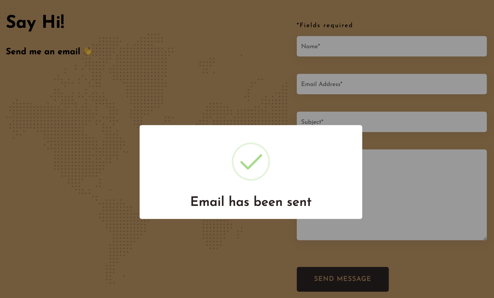
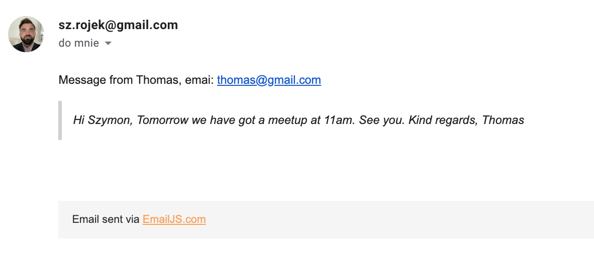

## 🎥 Preview site :arrow_right: [live demo](https://szymonrojek.github.io/my-music-website/)

## Description:

Music is always with me - nylon gutiar is the biggest passion in my live so I have decided to create my personal music website and share my music with you. Please check it out.

## Technologies:

<table>
  <tr>
    <td></td>
    <td></td>
    <td></td>
    <td></td>
  </tr>
</table>
<table>
  <tr>
    <td></td>
    <td> </td>
    <td></td>
  </tr>
 </table>

## Goals achived:

- detecting if the user has requested theme color: light or dark by using(prefers-color-scheme);
- storing object in the browser { mode: light or dark } by using Local Storage
- manually switching the mode between light/dark (smooth transition)
- connect Contact Form with an external tool [Email.js](https://www.emailjs.com/)

EmailJS helps to send emails by using client-side technologies only. I have created an email template and at the end after successful error verification the user triggers sending an email by clicking the submit button.

- when form is submitted the form User immediately is information as a successful modal or Error Modal will appear if there were any errors on the way. In this case I have used an external tool [sweet alert](https://sweetalert2.github.io/#example/)

The form has two actions:

- check the inputs value on keyup change
- check the inputs value on submit

I have added a custom debounce function just to prevent unnecessary events being triggered on every inpout change, also there is an event delegation - in this case I have a single handler on their common ancestor.

<table>
  <tr>
    
  </tr>
   <tr>
    
  </tr>
   <tr>
    
  </tr>
</table>

- Semantic HTML
- Invisible content for Screen Reader users
- BEM methodology
- Responsive Web Design
- Mobile first

## ToDo:

- possibly transfer project to React.js

## Usage:

1. Install project:

```
npm install
```

2. To start development and server for live preview

```
npm run dev
```

3. Build version

```
npm run build
```

4. Dist version

```
npm run deploy
```
